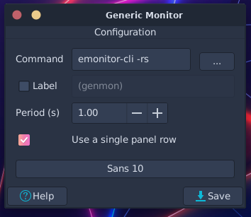

# emonitor-cli
Emonitor-cli is a first dpkg by Endd.
Emotion CPU, RAM or Swap,.. and display into Command Line, great for any low-end cli monitor like Genmon.
# Depends
Git: To clone this repo to "Home"
Python: Beacause this repo need python
# Installation
Clone this repo and change directory
```shell
git clone https://github.com/Wd-Endd/emonitor-cli.git
cd emonitor-cli
```
Run main.py script to packing emonitor-cli
```shell
python main.py
```
then, you can see any ``emonitor-cli-*.deb`` in ``.build/``, install it:
```shell
apt install ./.build/emonitor-cli-xxxxx.deb
```
or
```shell
sudo apt install ./.build/emonitor-cli-xxxxx.deb
```
# Usage
Help command
```zsh
> emonitor-cli
Usage: emonitor-cli [options]
Options:
-r: RAM
-s: Swap
-c: CPU

~ >                                                                 01:11:47 PM
```
Exsample:
```zsh
> emonitor-cli -r
RAM: 4.11GB/5.70GB (72%)
> emonitor-cli -c
CPU: 14.07%
> emonitor-cli -rs
RAM: 4.11GB/5.70GB (72%)
Swap: 3.14GB/6.29GB (50%)
> emonitor-cli -rsc
RAM: 4.14GB/5.70GB (72%)
Swap: 3.17GB/6.29GB (50%)
CPU: 14.01%

~ >                                                                 01:17:44 PM

```

And, you can apply it to more cli emonitor
Apply with Generic Monitor - Genmon:

